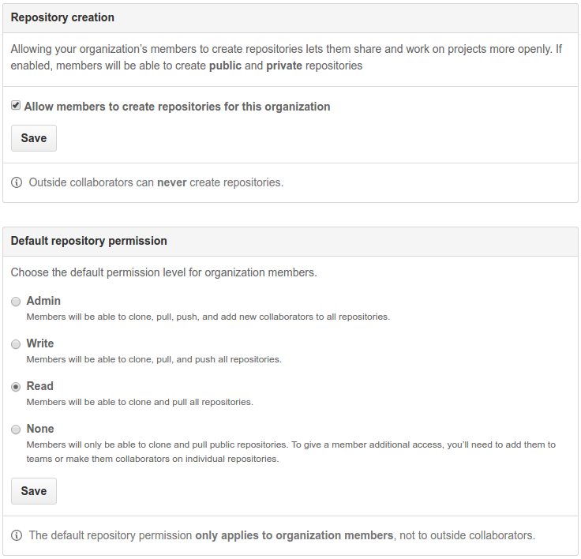

## Organization Features

The organization account provides features conducive to working in an organization.  These include 

- Members - individuals who have the default organization permissions
- Teams - groups of individuals who have adde permissions specific to the team

This image shows the available options for setting **Member** privileges

With respect to **Team** settings, there is the option to have a team be

- secret: only visible to members of the team and organization members, or 
- visible: facilitates collaboration and cross team communication (within comments, `@CCP-SAS/sassie` to notify the entire team about the comment.

Another setting available within an organization is **Blocked Users**.  Any users added to this list will no longer be able to

- open or comment on issues or pull requests
- star, fork, or watch
- add or edit wiki pages
 
### Notifications
By default, those who are contributors to a repository get notifications.  Others can also get notifications by selecting to watch the repo. This works wether or not they are part of the organization.  While still getting notifications, only members of the team assigned to a repo can accept pull requests.
